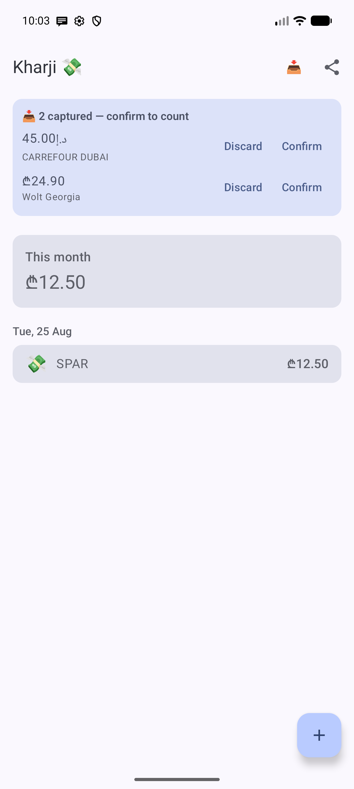

# Kharji 💸

**ხარჯი** (*kharji* — Georgian for "expense") — a multi-currency expense tracker
built for a life lived between two currencies.

  
  

<em>Left: multi-currency totals with a converted ≈GEL grand total.
Right: TBC/BoG transactions captured from notifications, held as pending until you confirm.</em>

Born from a real problem: earning and spending across **GEL and AED** means no
mainstream tracker fits. Kharji does three things most don't:

- 🏦 **Auto-capture from bank SMS** — a `NotificationListenerService` parses
  TBC and Bank of Georgia transaction messages and creates entries automatically.
  No manual entry for card payments.
- 💱 **True multi-currency** — every entry keeps its original currency; totals
  convert via cached FX rates with a full offline fallback.
- 📤 **Your data is yours** — one-tap CSV export, everything in Room, no cloud.

## Working today

- ✅ Manual entries: quick-add dialog, GEL/AED/USD/EUR, category chips, merchant/notes
- ✅ Day-grouped list, per-currency monthly totals, **converted ≈GEL grand total**
- ✅ FX rates auto-refreshed daily (open.er-api.com), cached in Room, offline
  fallback with stale-rate indicator
- ✅ CSV export via share sheet (RFC-4180-safe, tested)
- ✅ Money core: integer minor-unit arithmetic — no floating-point money, tested
- ✅ **TBC / BoG transaction parsing** — pure-Kotlin parsers (amounts in either decimal
  separator, currency as symbol *or* code, grouped thousands, merchant extraction),
  exhaustively unit-tested, with an **opt-in** `NotificationListenerService` that files
  captures as **pending** entries for you to confirm
- ✅ Conservative by design: OTP codes, balance notices, refunds and incoming transfers
  are never recorded as expenses

## Coming next

- Receipt scanning (CameraX + ML Kit) — tracked in issues
- More bank SMS fixtures as real formats are collected (parsers are pattern-based and
  easy to extend)

## Tech stack

Kotlin · Jetpack Compose (Material 3) · Room · NotificationListenerService ·
Ktor (FX rates) · WorkManager · CameraX + ML Kit (later)

## Status

✅ **v0.1.0** — manual entries, multi-currency totals with cached FX, CSV export, and
opt-in bank-notification capture all working. See [issues](../../issues) for what's next.

## Privacy

SMS/notification parsing is **opt-in**, runs entirely on-device, and only reads
messages from known bank senders. Nothing is uploaded anywhere, ever.

## License

[MIT](LICENSE)
